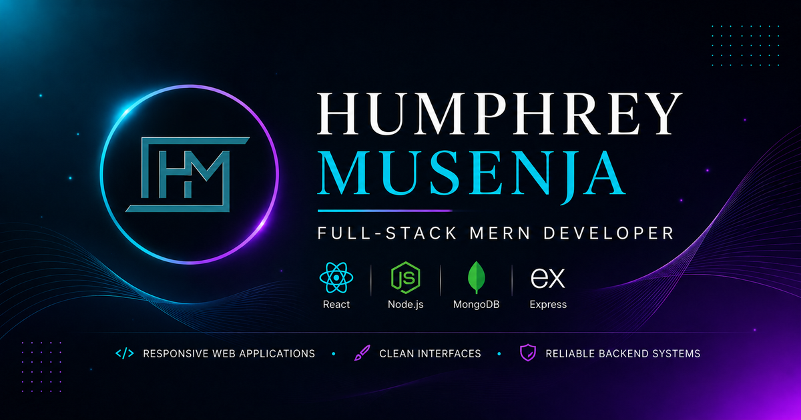

<!-- PROFILE-BANNER -->

  

### 👋 Building practical digital products from frontend to backend

I create **SaaS products, business applications, APIs, and responsive web experiences** with React, Node.js, Express, and MongoDB.

[🌐 Portfolio](https://hmusenja.com) · [💼 LinkedIn](https://linkedin.com/in/Humphrey-Musenja) · [✉️ Email](mailto:your.musenjahumphrey@yahoo.com)

---

## 👨‍💻 About Me

I'm a full-stack developer focused on turning **real ideas and business workflows into clear, maintainable digital products**.

I work across the application lifecycle — from responsive interfaces and product workflows to APIs, authentication, databases, testing, and deployment — with an emphasis on software that is **useful, reliable, and ready to grow**.

---

## 🧩 What I Build

- **🖥️ Full-Stack Applications** — responsive frontends, APIs, authentication, databases, and business workflows.
- **🎨 Frontend & UI** — accessible React interfaces with clear hierarchy and user-focused experiences.
- **⚙️ Backend & APIs** — application logic, data modelling, integrations, authentication, and maintainable services.
- **📈 Product Improvements** — UI/UX refinement, workflow optimisation, feature development, and frontend restructuring.

---

## 🚀 Featured Projects

### PayTrace

**WhatsApp-first CRM for practical small-business workflows**

A production-oriented MERN SaaS application for managing leads, follow-ups, quotes, payments, reminders, notifications, and customer workflows from a mobile-first interface.

`React` `Node.js` `Express` `MongoDB` `Authentication` `i18n`

[View Repository →](https://github.com/HMusenja/PayTrace)

---

### Portfolio & Client Onboarding Platform

**A developer portfolio designed to turn visitors into project conversations**

My production portfolio combines project case studies, service discovery, responsive UI/UX, and a structured client onboarding workflow with project inquiries, administration, and email communication.

`React` `Tailwind CSS` `Node.js` `Express` `MongoDB`

[Live Website →](https://hmusenja.com) · [Repository →](https://github.com/HMusenja/hmusenja-tech-portfolio)

---

### TripleCRM

**CRM, operations, and customer-facing experiences in one full-stack product**

A business-focused MERN application combining CRM workflows, administrative tools, structured content management, responsive customer experiences, and production-oriented search and SEO architecture.

`React` `Node.js` `Express` `MongoDB` `REST API`

[View Repository →](https://github.com/HMusenja/deployment-triplecrm)

[Explore all repositories →](https://github.com/HMusenja?tab=repositories)

---

## 🛠️ Technology Stack

### Frontend

`JavaScript` · `React` · `React Router` · `Tailwind CSS` · `HTML5` · `CSS3`

### Backend & Data

`Node.js` · `Express` · `MongoDB` · `Mongoose` · `REST APIs`

### Development & Delivery

`Git` · `GitHub` · `Vite` · `npm` · `Vitest`

---

## 🧠 How I Approach Development

- **Product first** — clear user journeys and practical business requirements guide the implementation.
- **Maintainable by design** — reusable components, clear architecture, and code that can evolve.
- **Responsive & accessible** — mobile-first experiences that remain usable across devices and users.
- **Built for production** — secure patterns, testing, validation, deployment, and maintainability matter.

---

## 🌱 Currently Building & Expanding

`SaaS Architecture` · `Testing` · `Internationalisation` · `Automation` · `AI Integrations` · `Cloud Deployment`

---

## 🤝 Let's Work Together

Building a SaaS product, business application, internal tool, or improving an existing digital product?

I work with **businesses, startups, and teams** to turn requirements into practical, maintainable web applications.

### [Start a Project →](https://hmusenja.com)

[Explore my portfolio](https://hmusenja.com) · [View all repositories](https://github.com/HMusenja?tab=repositories)

---

**Building useful products, one thoughtful iteration at a time.**
